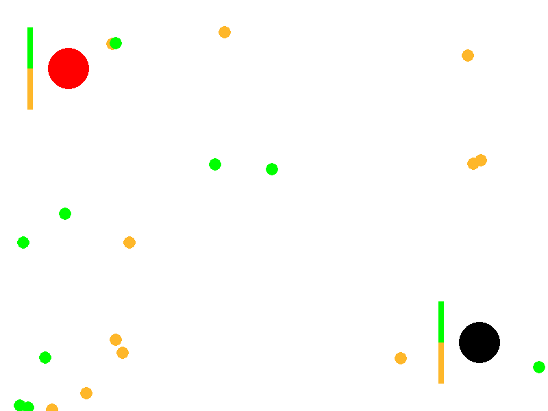
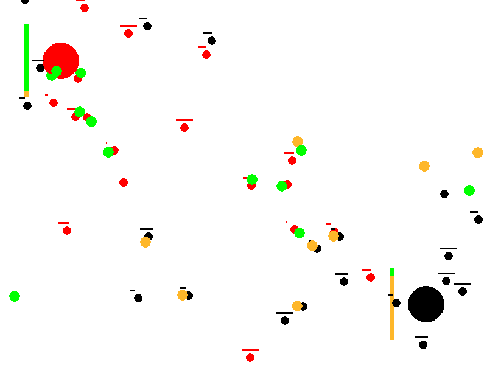
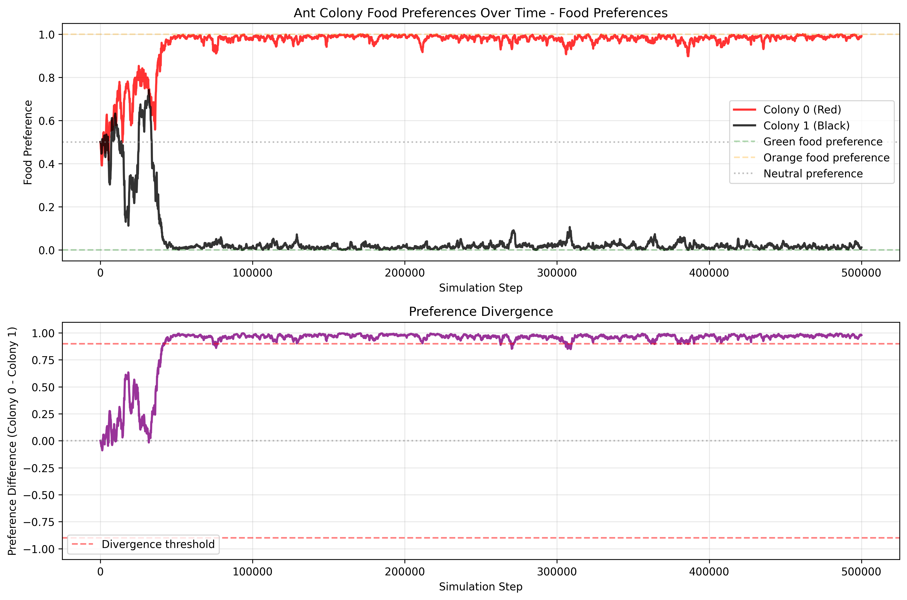
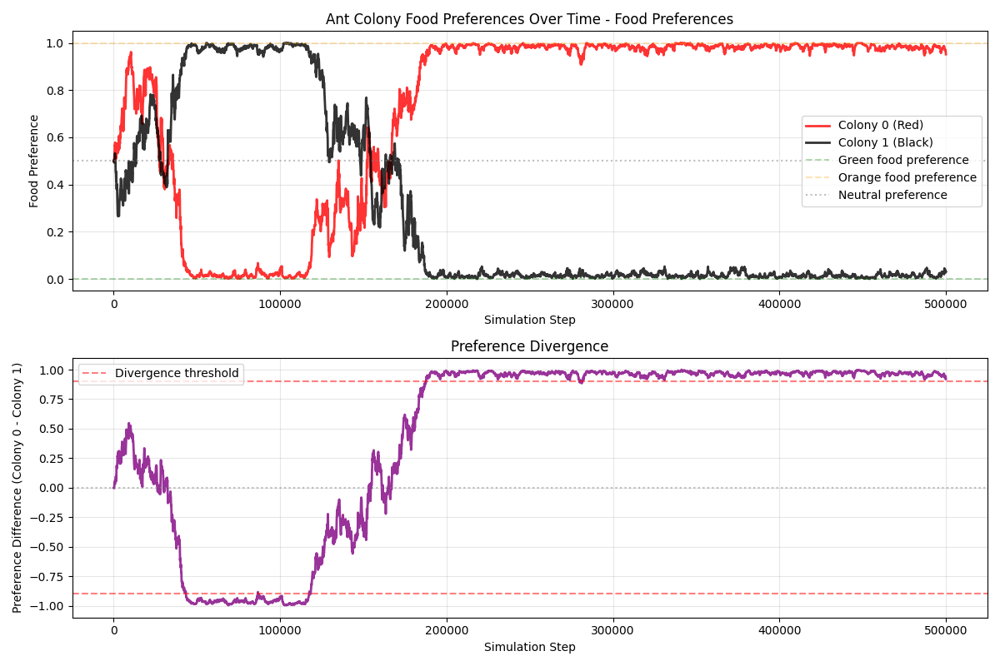
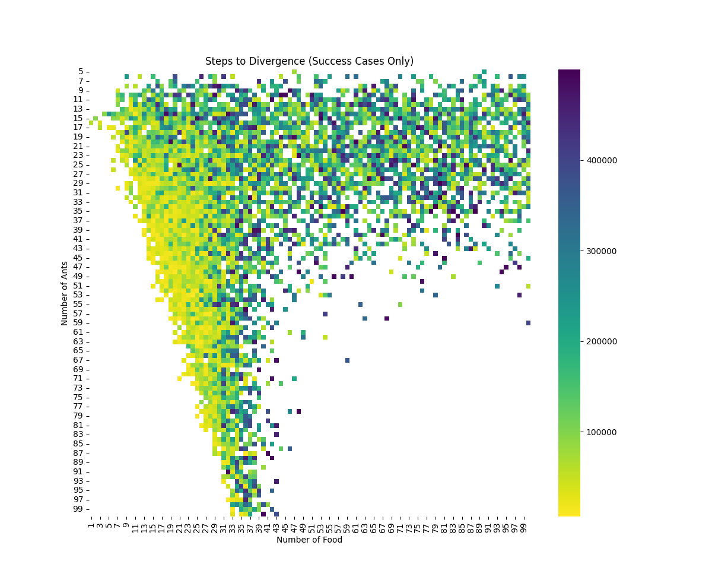
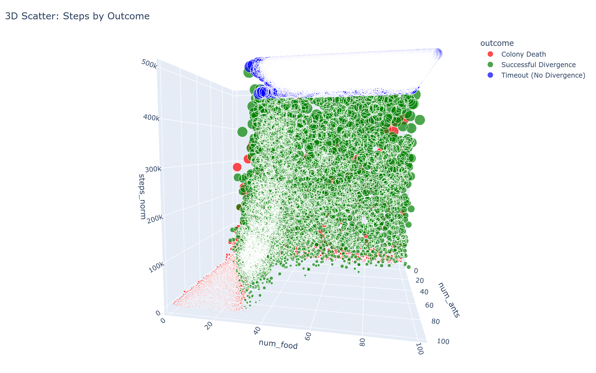

# Ant Colonies Simulation

TL;DR: Pygame simulation of two ant colonies competing for food, showcasing emergent properties: colonies evolve distinct food preferences (green vs. orange) through an evolutionary process, specialize to reduce competition, and exhibit dynamic survival or extinction driven by resource scarcity and inter-colony conflicts.

## Overview

This project is a Python-based simulation of competing ant colonies using Pygame for visualization (with support for headless execution via a dummy video driver). It models two ant colonies (red and black) that forage for food resources (green and orange items), develop preferences for specific food types over time, and engage in conflicts over resources. The simulation explores emergent behaviors such as resource specialization, colony survival, and evolutionary adaptation through mechanisms mimicking biological evolution.

The core file, `src/colony.py`, implements the entire simulation logic, including entity classes (Colony, Ant, Food, Board), movement, decision-making, collisions, and visualization. It can be run with an optional command-line argument for the number of initial food items (e.g., `python src/colony.py 30`), defaulting to 20 if unspecified.

The simulation runs for up to 500,000 steps or until a stopping condition is met (e.g., extreme divergence in food preferences between colonies or the extinction of one colony). Results are appended to a `results.txt` file in CSV format: `NUM_ANTS,NUM_FOOD,steps_taken,colony_a_alive (0/1),colony_b_alive (0/1)`.

Commented-out sections at the end provide optional Matplotlib plotting for analyzing food preference evolution and cumulative death counts over time.

## Purpose and What This File is Trying to Show

This simulation demonstrates how simple rules for individual agents (ants) can lead to complex, emergent group behaviors in a competitive environment. Specifically, it illustrates:

- **Evolution of Preferences**: Colonies start with neutral food preferences (50% green, 50% orange). Through successful foraging and reproduction, preferences reinforce and diverge, modeling a form of genetic or cultural evolution. One colony may specialize in green food while the other focuses on orange, reducing direct competition.
  
- **Resource Competition and Conflict**: Ants not only gather food but also chase and fight enemy ants carrying desirable food, leading to deaths and resource drops. This shows how scarcity (limited food) impacts colony survival.

- **Emergent Specialization and Survival Dynamics**: The simulation tests whether colonies can achieve a "wanted state" of polarized preferences (e.g., one >95% green preference, the other <5%), representing efficient resource partitioning. It also tracks colony extinction if all ants die from fights or failure to reproduce.

- **Why This Matters**: This could be a model for studying biological phenomena like niche partitioning in ecology, evolutionary algorithms in AI (via preference inheritance and mutation), or social dynamics in competing groups. It's designed for experimentation—varying parameters like ant count, food count, or learning rate to observe outcomes (e.g., does more food reduce deaths? Do preferences always diverge?).

The mechanics mimic evolutionary algorithms rather than reinforcement learning: individual ants have fixed preferences set at creation (like genes), and colonies evolve over "generations" through selection (successful foragers reproduce with random mutations) and removal (deaths from conflict), without agents updating behaviors during their lifetime. Randomness in mutations and choices drives variation, with specialization emerging implicitly from survival pressures, such as reduced fights over different foods, without pre-encoded goals beyond basic foraging rules.

## Core Dynamics

The simulation's main dynamic revolves around a purely evolutionary process driven by random variation and natural selection, without any explicit learning, optimization functions, or predefined target states. Here's a breakdown:

- **No Learning, Only Genetic Variation**: Individual ants do not learn or adapt their behavior during their lifetime; their food preference (a value between 0.0 for orange and 1.0 for green) is fixed at "birth" and acts like a genetic trait. When an ant successfully returns food to the colony, it spawns a new ant with a slightly mutated preference (varied by ±0.1 via the learning rate, which is actually a mutation rate). Unsuccessful ants (those killed in conflicts or failing to reproduce) are removed, effectively selecting for traits that lead to survival and reproduction. This mimics Darwinian evolution: variation through random mutation, inheritance to offspring, and differential survival based on environmental fit.

- **Absence of Target State or Fitness Function**: There is no encoded goal, reward system, or fitness function guiding the process toward a specific outcome (e.g., no penalty for non-specialization or bonus for divergence). The "wanted state" of polarized preferences (one colony >0.95 for one food type, the other <0.05) is merely an observer-defined stopping condition for analysis, not a driver of the simulation. Outcomes like specialization or extinction emerge solely from bottom-up interactions, not top-down design.

- **Interactions with the Environment**: The environment is a bounded 800x600 grid with randomly placed food items (green or orange) that respawn upon collection or ant death. Ants interact via:
  - **Sensing and Foraging**: Ants perform random walks unless they detect food or enemy ants within a 50-unit vision radius. They probabilistically target food matching their fixed preference, introducing bias without learning.
  - **Competition and Conflict**: Ants can chase enemy ants carrying preferred food, leading to collisions where both lose life points if one is carrying food. This creates indirect selection pressure: preferences that reduce overlap (e.g., one colony favoring green, the other orange) lower conflict rates, as ants are less likely to fight over the same resources.
  - **Resource Scarcity**: Limited food (default 20 items) forces competition; successful foraging replenishes colony ants, while failures lead to decline. The environment is dynamic—food respawns randomly—but neutral, with no adaptive changes beyond ant actions.

Overall, the dynamic highlights how complexity arises from simplicity: random genetic drift, combined with environmental pressures (scarcity, competition), can lead to adaptive specialization without any intelligent design or learning mechanism.

## Mechanics

### Core Entities
- **Colonies**: Fixed positions (red at top-left, black at bottom-right). Each has a capacity for ants, a collective food preference (averaged from ants), and spawns new ants upon successful food delivery.
- **Ants**: Mobile agents with position, angle, speed, life (starts at 100), and individual food preference (0.0 = fully orange, 1.0 = fully green). They can carry food, target items/enemies, and die from combat.
- **Food**: Randomly placed green or orange items. Respawn randomly when collected or dropped upon death.
- **Board**: Manages global state, tracks deaths, steps, and food items.

### Ant Behavior Loop (Per Step)
1. **Movement**:
   - If carrying food: Move back to colony at half speed (5 units/step). Upon arrival, drop food, respawn a new ant with slightly varied preference (± learning rate of 0.1), and randomize direction.
   - If targeting food: Move directly toward it at full speed (10 units/step). Pick it up if reached and available.
   - If targeting an enemy ant (with desirable food): Chase it at full speed.
   - Otherwise: Random walk with wall bouncing (reflect angle on edges).

2. **Sensing/Targeting** (within 50-unit vision radius):
   - Preferentially look for food matching probabilistic preference (e.g., high preference = more likely to choose green).
   - If no suitable food, target enemy ants carrying preferred food.

3. **Collisions and Combat**:
   - If carrying food and colliding with an enemy (within 14 units), both lose 1 life per step.
   - At 0 life, ant dies: Drops food (if any), increments global death count, and is removed from colony.

4. **Colony Updates**:
   - After all ant actions, refresh: Remove dead ants, update average preference, and check if colony is extinct (no ants left).

### Simulation Parameters
- **Constants** (editable in code):
  - `NUM_ANTS`: Total ants (split evenly between colonies, default 80).
  - `NUM_FOOD`: Initial food items (command-line arg or default 20).
  - `ANT_SPEED`: 10 units/step (halved when carrying).
  - `VISION_RADIUS`: 50 units for sensing.
  - `LEARNING_RATE`: 0.1 (variance in new ant preferences).
  - `MAX_STEPS`: 500,000 (hard limit).
- **Colors and Sizes**: Ants (7-unit radius), food (9-unit), colonies (30-unit).

### Ending Conditions
- Max steps reached.
- Preferences diverge extremely (one colony >0.95 green, other <0.05).
- One or both colonies extinct.

### Visualization
- Screen: 800x600 white background.
- Colonies: Circles with preference bars (green bottom, orange top).
- Ants: Colored circles with health bars; carried food shown offset.
- Food: Colored circles.
- Headless Mode: Enabled by default (`SDL_VIDEODRIVER='dummy'`); override for visual runs.

### Output and Analysis
- Appends results to `results.txt` for batch runs/experiments.
- Optional plots (uncomment to enable):
  - Food preference over steps for each colony.
  - Cumulative deaths over steps.

## First Results

### Simulation Start State

*Beginning of the simulation: both colonies start with equal numbers of ants and neutral food preferences (50% green, 50% orange). Food items are evenly distributed across the environment.*

### Simulation End State

*End of the simulation: colonies have developed distinctive food preferences through evolutionary pressure. The red colony now strongly prefers green food, while the black colony prefers orange food, demonstrating emergent specialization.*

### Food Preference Divergence Over Time

*The divergence of food preferences over time during a single simulation run. Colonies start with neutral preferences and gradually specialize in different food types.*

### Preference Swap Phenomenon

*Even though divergence is generally stable, preference swaps can occur, showing the dynamic nature of colony specialization.*

### Steps to Divergence Analysis

*Results from 10,000 simulations showing the distribution of steps required for divergence. Note that the fastest divergence occurs at the edge of extinction, indicating a critical phase transition.*

### 3D Visualization of Divergence Patterns

*Three-dimensional visualization of the divergence patterns, providing additional perspective on the relationship between simulation parameters and outcomes.*

## Command-Line Arguments

The simulation supports the following command-line arguments:

- `--num_ants N` — Number of ants (default: 80, split evenly between colonies)
- `--num_food N` — Number of food items (default: 20)
- `--output_mode MODE` — Output mode: `display`, `files`, or `dummy` (default: `dummy`)
- `--stats` — Save detailed statistics to `stats.txt` (default: off)
- `--no_stop_on_divergence` — Continue simulation even if colonies' preferences diverge (default: stop on divergence)

Example:
```bash
python src/colony.py --num_ants 100 --num_food 30 --output_mode files --stats --no_stop_on_divergence
```

## Frame Output and Interval

- When using `--output_mode files`, frames are saved as PNG images in the `frames/` directory.
- Frame filenames are monotonically increasing: `frame_000001.png`, `frame_000002.png`, ... (no gaps, not based on simulation step).
- The interval for saving frames and statistics is controlled by `FRAME_INTERVAL` (default: 100 steps).

## Stopping Conditions

The simulation stops when one of the following is true:
- Maximum steps (`MAX_STEPS`, default: 500,000) is reached
- One or both colonies go extinct
- **By default:** Preferences diverge (one colony >0.95, other <0.05)
- **If `--no_stop_on_divergence` is set:** Simulation continues even if preferences diverge

## Quick Running the Simulation
1. Install dependencies: `pip install pygame matplotlib` (though Matplotlib is optional).
2. Run: `python src/colony.py [num_food]` (e.g., `python src/colony.py 50`).
3. For visualization, set `os.environ['SDL_VIDEODRIVER']` to your system's driver (e.g., comment out the dummy line).
4. Analyze `results.txt` for trends across runs.

## Potential Extensions
- Add more colonies or food types.
- Introduce environmental obstacles or pheromones for pathfinding.
- Parameter sweeps to study phase transitions (e.g., when does specialization emerge?).

This project serves as an educational tool for agent-based modeling and could be adapted for research in evolutionary computation or ecology.

## Installation

To install and run this project on a Debian-based system (or most Linux systems):

```bash
sudo apt update
sudo apt upgrade -y
sudo apt install -y git python3-venv

git clone https://github.com/KintaroAI/ants.git
cd ants
make install
```

Or for development with testing tools:
```bash
make install-dev
```

## Usage

Run the simulation:
```bash
make run
```

Run with statistics collection:
```bash
make run-stats
```

Show statistics visualization:
```bash
make show-stats
```

Or run directly:
```bash
python src/colony.py --output_mode dummy --num_ants 100 --num_food 30
python src/colony.py --stats --output_mode dummy
python src/colony.py --output_mode files --stats --no_stop_on_divergence
python src/show_stats.py --stats_file stats.txt --output plot.png
python src/show_stats.py --save  # Force save to file
```

## Project Structure

- `src/colony.py` - Main simulation file
- `requirements.txt` - Python dependencies
- `README.md` - Project documentation

## Output Modes

The simulation supports three output modes:

- **`display`** - Shows the simulation in a pygame window
- **`files`** - Saves frames as PNG images in a `frames/` directory
- **`dummy`** - Runs without any visual output or file saving (fastest)

Use `--output_mode` argument to specify the mode:
```bash
python src/colony.py --output_mode display
python src/colony.py --output_mode files
python src/colony.py --output_mode dummy
```

## Statistics Collection

Use the `--stats` flag to collect detailed statistics during simulation:

```bash
python src/colony.py --stats
```

This will create a `stats.txt` file with the following format:
```
step,colony_0_preference,colony_1_preference
1,0.500000,0.500000
2,0.510000,0.490000
...
```

Each line contains:
- `step`: Current simulation step
- `colony_0_preference`: Food preference of colony 0 (0.0 = green, 1.0 = orange)
- `colony_1_preference`: Food preference of colony 1 (0.0 = green, 1.0 = orange)

## Visualization

After running with statistics, you can visualize the results:

```bash
make show-stats
```

This creates a plot file (`ant_colony_stats.png`) with two graphs:
1. **Food Preferences Over Time** - Shows how each colony's food preference evolves
2. **Preference Divergence** - Shows the difference between colony preferences

The visualization includes:
- Reference lines for green (0.0) and orange (1.0) food preferences
- Neutral preference line (0.5)
- Divergence thresholds (±0.9) where colonies strongly prefer different foods

## Available Commands

- `make help` - Show all available commands
- `make venv` - Create virtual environment
- `make install` - Install dependencies
- `make install-dev` - Install dependencies with development tools
- `make run` - Run the simulation
- `make run-stats` - Run simulation with statistics collection
- `make show-stats` - Show statistics visualization
- `make test` - Run tests
- `make lint` - Run code linting
- `make format` - Format code
- `make clean` - Clean generated files
- `make venv-clean` - Remove virtual environment